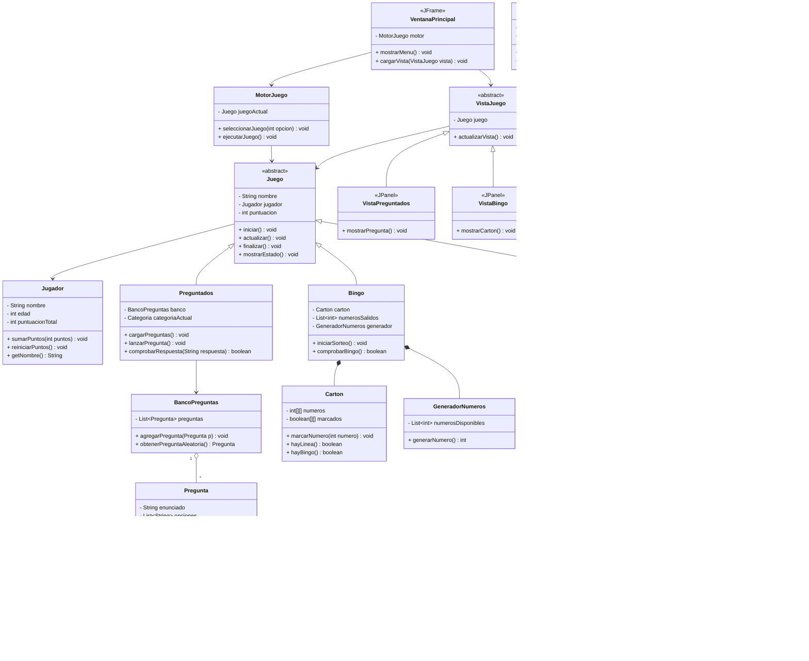

# Proyecto-app-clase
Crear un videojuego para clases 

```mermaid
classDiagram
direction TB

%% =========================
%% MODELO (LOGICA)
%% =========================

class Juego {
  <<abstract>>
  - String nombre
  - Jugador jugador
  - int puntuacion
  + iniciar() void
  + actualizar() void
  + finalizar() void
  + mostrarEstado() void
}

class Jugador {
  - String nombre
  - int edad
  - int puntuacionTotal
  + sumarPuntos(int puntos) void
  + reiniciarPuntos() void
  + getNombre() String
}

class MotorJuego {
  - Juego juegoActual
  + seleccionarJuego(int opcion) void
  + ejecutarJuego() void
}

MotorJuego --> Juego
Juego --> Jugador

%% =========================
%% PREGUNTADOS (MODELO)
%% =========================

class Preguntados {
  - BancoPreguntas banco
  - Categoria categoriaActual
  + cargarPreguntas() void
  + lanzarPregunta() void
  + comprobarRespuesta(String respuesta) boolean
}

class BancoPreguntas {
  - List~Pregunta~ preguntas
  + agregarPregunta(Pregunta p) void
  + obtenerPreguntaAleatoria() Pregunta
}

class Pregunta {
  - String enunciado
  - List~String~ opciones
  - String respuestaCorrecta
  - Categoria categoria
  + esCorrecta(String respuesta) boolean
}

class Categoria {
  <<enumeration>>
  HISTORIA
  CIENCIA
  DEPORTE
  ARTE
}

Juego <|-- Preguntados
Preguntados --> BancoPreguntas
BancoPreguntas "1" o-- "*" Pregunta
Pregunta --> Categoria

%% =========================
%% BINGO (MODELO)
%% =========================

class Bingo {
  - Carton carton
  - List~int~ numerosSalidos
  - GeneradorNumeros generador
  + iniciarSorteo() void
  + comprobarBingo() boolean
}

class Carton {
  - int[][] numeros
  - boolean[][] marcados
  + marcarNumero(int numero) void
  + hayLinea() boolean
  + hayBingo() boolean
}

class GeneradorNumeros {
  - List~int~ numerosDisponibles
  + generarNumero() int
}

Juego <|-- Bingo
Bingo *-- Carton
Bingo *-- GeneradorNumeros

%% =========================
%% BRICK BREAKER (MODELO)
%% =========================

class BrickBreaker {
  - Pelota pelota
  - Barra barra
  - Nivel nivel
  + iniciarNivel() void
  + detectarColisiones() void
  + actualizar() void
}

class Pelota {
  - double x
  - double y
  - double velocidadX
  - double velocidadY
  + mover() void
  + rebotar() void
}

class Barra {
  - double x
  - double ancho
  + moverIzquierda() void
  + moverDerecha() void
}

class Nivel {
  - List~Ladrillo~ ladrillos
  + cargarNivel() void
  + quedanLadrillos() boolean
}

class Ladrillo {
  - double x
  - double y
  - int resistencia
  + recibirImpacto() void
  + estaDestruido() boolean
}

Juego <|-- BrickBreaker
BrickBreaker *-- Pelota
BrickBreaker *-- Barra
BrickBreaker *-- Nivel
Nivel "1" *-- "*" Ladrillo

%% =========================
%% VISTA (SWING)
%% =========================

class VentanaPrincipal {
  <<JFrame>>
  - MotorJuego motor
  + mostrarMenu() void
  + cargarVista(VistaJuego vista) void
}

class VistaJuego {
  <<abstract>>
  <<JPanel>>
  - Juego juego
  + actualizarVista() void
}

class VistaPreguntados {
  <<JPanel>>
  + mostrarPregunta() void
}

class VistaBingo {
  <<JPanel>>
  + mostrarCarton() void
}

class VistaBrickBreaker {
  <<JPanel>>
  + dibujarJuego() void
}

VistaJuego <|-- VistaPreguntados
VistaJuego <|-- VistaBingo
VistaJuego <|-- VistaBrickBreaker

VentanaPrincipal --> MotorJuego
VentanaPrincipal --> VistaJuego
VistaJuego --> Juego

%% =========================
%% CONTROLADOR
%% =========================

class ControladorJuego {
  - Juego juego
  - VistaJuego vista
  + iniciarJuego() void
  + manejarEvento() void
}
```
ControladorJuego --> Juego
ControladorJuego --> VistaJuego
VentanaPrincipal --> ControladorJuego
